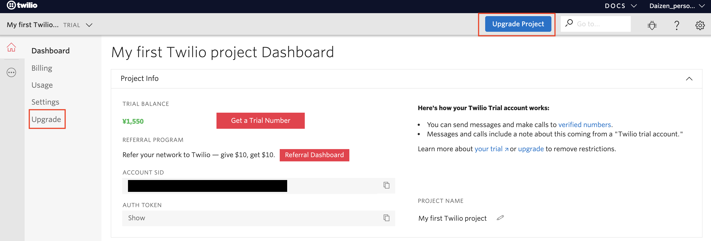

# Twilioアカウントのアップグレードとプロモコードの適用方法
## はじめに
このドキュメントはTwilioから提供されるプロモコードをアカウントに反映させる方法をご紹介します。

## 注意事項
Twilioから提供されるプロモコードを適用する場合、通常、下記の制限があります。
- プロモーションコード適用する場合は、トライアルアカウントをアップグレードする必要があります。
- トライアルアカウントをアップグレードした段階で、それまで保有していたクレジットが0になります。
- クレジットカード情報を登録し、支払方法を設定する必要があります。
- アップグレード時のプロモーションコードは１度のみの利用となり、別のプロモーションコードを利用することはできません。

## アカウントのアップグレードとプロモコードの適用方法
まだアカウントを作成していない場合は、こちらの[手順](../01-Twilio-Phone-Number/01-01-Signup.md)に従い、Twilioアカウントを作成してください。

[Twilioホームページ](https://www.twilio.com/)をブラウザーで開き、[LOG IN](https://www.twilio.com/login) をクリックするか、[コンソール](https://www.twilio.com/console)に直接移動します。

このコンソール画面で、__Upgrade__ をクリックします。

Add Company Addressで国を選択し、住所情報を入力します。

Add Billing Address（請求先住所）を入力します。同じ住所であれば、Same as Company Addressにチェックを入れます。

Add Payment Information and Fundsにクレジットカード情報を入力し、USE PROMO CODEをクリックします。

 
提供されたコードを入力します。ここでAutomatic RechargeをEnableにするとアカウントのクレジットがなくなった場合の自動チャージが有効になります。ご注意ください。

最後にUpgrade Accountボタンをクリックするとアカウントがアップグレードされ、プロモーションコードに設定されたクレジットが適用されます。

## 関連リソース

- [Twilio 101ハンズオン](../../README.md)
