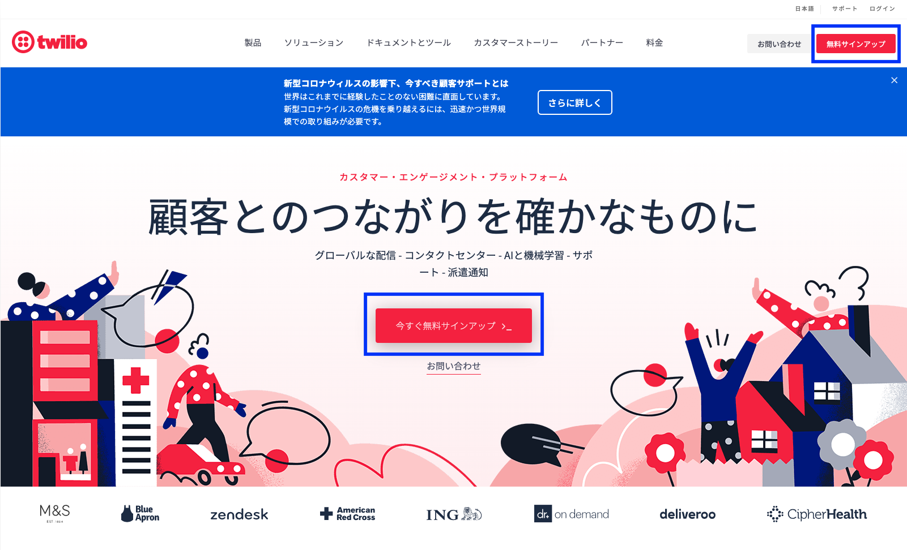
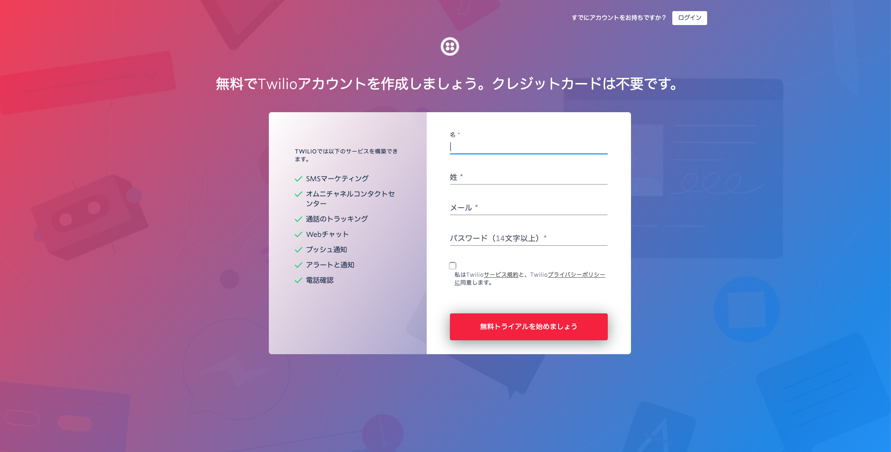

#  手順1: Twilioアカウントの作成
## はじめに
この手順では、Twilioアカウントを作成します。既にアカウントを作成し、コンソールにアクセスできている場合は、[手順2](./01-02-PurchasePhoneNumber.md)へ進んでください。
## 1-1. アカウントの作成を開始
[Twilioホームページ](https://www.twilio.com/)をブラウザーで開き、[今すぐ無料サインアップ](https://www.twilio.com/try-twilio) ボタンをクリックします。

名、姓、メール、パスワード(14文字以上)を入力します。また、サービス規約とブライバシーポリシーに同意することを示すボックスをチェックし、__無料トライアルを始めましょう__ ボタンをクリックします。

## 1-2. Emailアドレス、電話番号の確認、コンソールのセットアップ
登録したEmailに確認メールが送られます。メール本文の __Confirm Your Email__ をクリックし、アカウントを有効化させます。

リンクをクリックすると、続けて電話番号の確認が行われます。トライアルを開始するためには、SMSを受信可能な電話番号が必要になります。

電話番号を入力し、__確認__ ボタンをクリックすると、確認コードが送信されます。送られてきたコードを入力し、 __Submit__ ボタンをクリックします。

電話番号の確認が完了すると利用用途やプログラミング言語などいくつかの質問が画面に表示されます。選択によって利用できる機能は変わるわけではないので、__Skip to dashboard__ ボタンを押しても構いません。

コンソールが表示され、サインアップは完了です。

## 1-3. コンソールへのアクセス
Twilioのさまざまなサービスの利用状況の確認や設定はコンソールから行う事ができます。
コンソールには、[Twilioホームページ](https://www.twilio.com/)をブラウザーで開き、[LOG IN](https://www.twilio.com/login) をクリックするか、[コンソール](https://www.twilio.com/console)に直接移動します。

特に名前を設定していなければ、「__My first Twilio project Dashboard__」が表示されています。このコンソールでは、プロジェクトに紐づいているクレジットの合計を確認できます。

また、個別のプログラムからTwilioのサービスを利用できるACCOUNT SID、AUTH TOKENを確認できます。

## 1-4. トライアルアカウントを利用した場合の制限
トライアルアカウントを利用する場合は、以下のような __制限__ があります。

- トライアルアカウントで取得できる電話番号は１つのみです。複数の番号を取得する場合は、アカウントをアップグレードする必要があります。
- トライアルアカウントから送信、架電できる番号はあらかじめ認証された [verified numbers](https://www.twilio.com/console/phone-numbers/verified) のみです。
- SMSや電話の冒頭にトライアルアカウントを利用している旨を伝えるメッセージ（英語）が流れます。

その他の制限については関連リソースをご覧ください。

## 関連リソース

- [無料のTwilioトライアルアカウントの使用方法](https://jp.twilio.com/docs/usage/tutorials/how-to-use-your-free-trial-account)

## 次の手順
[手順2: 電話番号の取得](./01-02-PurchasePhoneNumber.md)