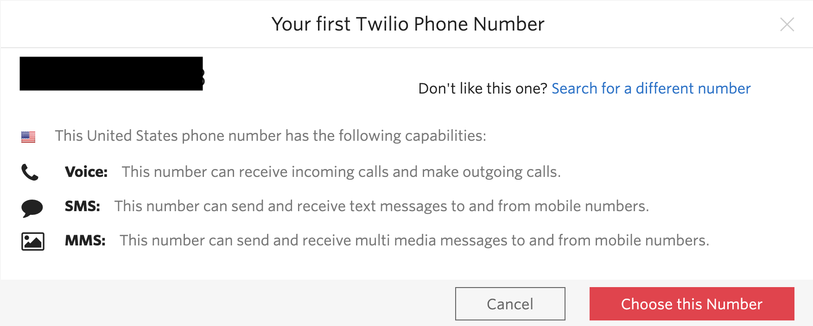

#  手順2: 電話番号の取得
## はじめに
この手順では、Twilioコンソールから電話番号を取得します。Twilioでは世界各国の電話番号をあらかじめ取得し、ユーザーに提供しています。Twilioユーザーはこの番号を利用し、SMSの送受信や電話の発信・受信ができます。

## 2-1. コンソールにアクセス
[Twilioホームページ](https://www.twilio.com/)をブラウザーで開き、[__LOG IN__](https://www.twilio.com/login) をクリックするか、[コンソール](https://www.twilio.com/console)に直接移動します。

## 2-2. SMSの送受信が可能な電話番号を取得
はじめてTwilioを使用する場合は、コンソールから [Get a Trial Number](https://www.twilio.com/console/phone-numbers/trial-number/modal?capability[]=sms)をクリックし、トライアル番号を取得することができます。
この番号はSMSの送受信が可能な番号が表示されます。日本などその他の国の番号を取得することもできますが、今回のハンズオンでは、表示された番号を選択してください。

  

Twilioでは米国の電話番号を約1ドル/月で保持することができます。この価格は電話番号を取得する国によって異なります。回線維持料は電話番号を取得した段階でクレジットから __減算__ されるため、番号の取得とリリースを続けて行わないようにご注意ください。

## 関連リソース

- [無料のTwilioトライアルアカウントの使用方法](https://jp.twilio.com/docs/usage/tutorials/how-to-use-your-free-trial-account)

## 次のハンズオン
[ハンズオン: メッセージ（SMS/MMS）の利用](../02-Twilio-SMS/02-00-Overview.md)