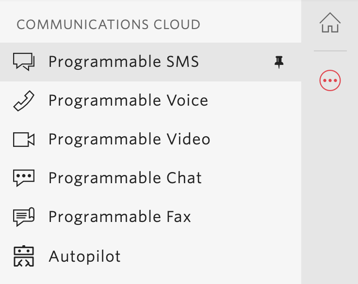
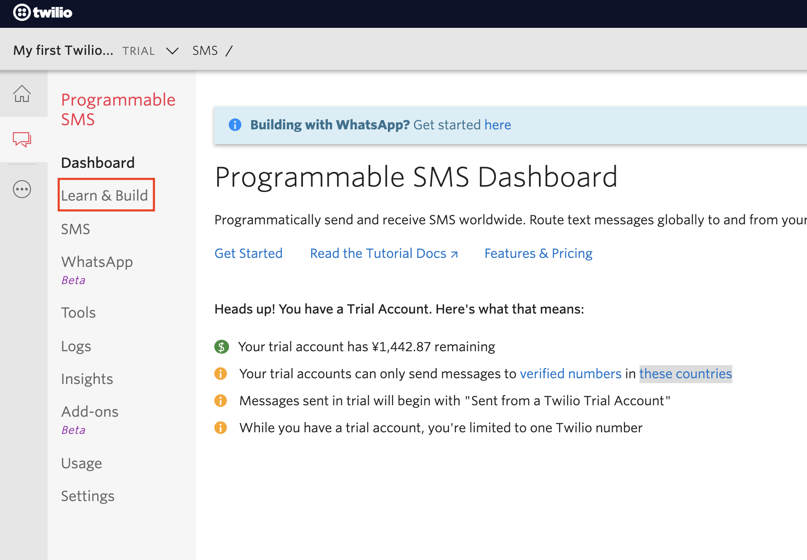
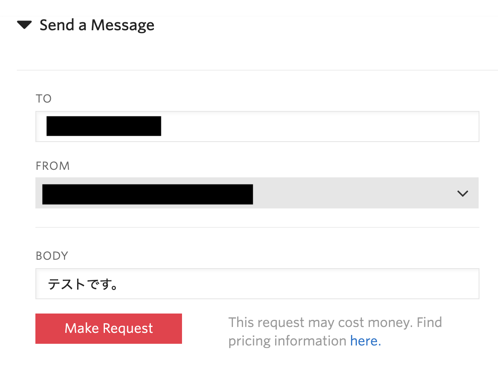
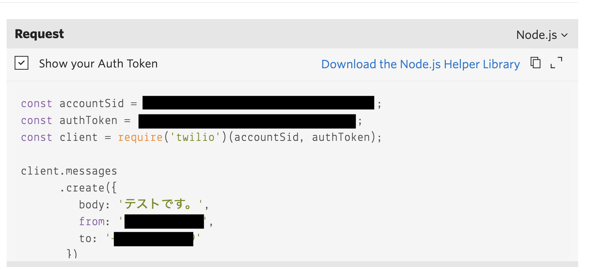

#  手順1: コンソールからSMSを送信
## はじめに
この手順では、Twilioコンソールを用いてSMSを送信するコードを確認します。

## 1-1. コンソールにアクセス
[Twilioホームページ](https://www.twilio.com/)をブラウザーで開き、[LOG IN](https://www.twilio.com/login) をクリックするか、[コンソール](https://www.twilio.com/console)に直接移動します。

## 1-2. Programmable SMSダッシュボードにアクセス
コンソールのサイドバーから __All Products & Services__ をクリックすると、サイドバーが展開されます。そこで __Programmable SMS__ をクリックします。

## 1-3. テストSMSメッセージを送信
Programmable SMSから __Learn & Build__ をクリックすると送信先番号、送信元番号、内容（テキスト）を設定し、テストメッセージを送信することができます。

TOには、__verified number__ に登録されている番号を、FROMには、先ほど取得した番号を設定し、テストメッセージを入力したのち、__Make Request__ をクリックし、端末で送られてきたメッセージを確認してください。

また、右側にはプログラムで利用できるコードが利用する言語に合わせて表示されます。

このコードを使用し、SMSを送信する方法については関連リソースをご覧ください。

## 関連リソース

- [無料のTwilioトライアルアカウントの使用方法](https://jp.twilio.com/docs/usage/tutorials/how-to-use-your-free-trial-account)

## 次の手順:
[手順2: コンソールでSMSの受信応答を設定](./02-02-ReceiveSMS.md)