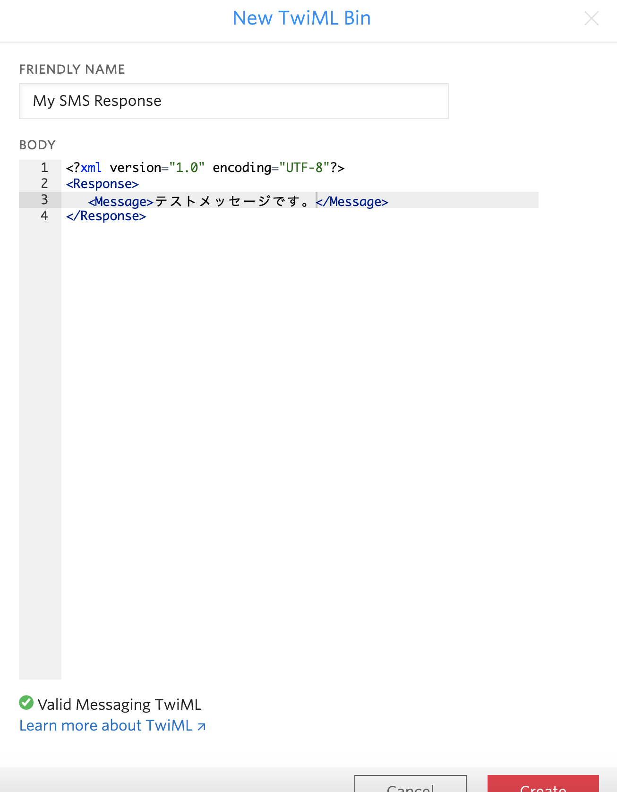

#  手順2: コンソールでSMSの受信応答を設定
## はじめに
この手順では、Twilioコンソールを用いてSMSを受信した際に応答するメッセージを設定します。

## 1-1. コンソールにアクセス
[Twilioホームページ](https://www.twilio.com/)をブラウザーで開き、[LOG IN](https://www.twilio.com/login) をクリックするか、[コンソール](https://www.twilio.com/console)に直接移動します。


## 1-2. Phone Numbersダッシュボードにアクセス
コンソールのサイドバーから __All Products & Services__ をクリックすると、サイドバーが展開されます。そこで __Phone Numbers__ をクリックします。


ここでは購入した番号の一覧が表示されます。


## 1-3. 購入した電話番号の詳細情報を表示し、Messagingを確認
一覧から先ほど購入した番号をクリックすると、詳細画面に遷移します。
画面をスクロールし、Messagingのセクションを表示させます。


A MESSAGE COMES INの項目では、この電話番号でメッセージ（SMS）を受信した際にどのような応答を返すかを設定できます。標準ではデフォルトメッセージを返すようになっています。

## 1-4. TwiML Binを使い静的な応答メッセージを設定
Programmable SMSでは __TwiML__ と呼ばれるマークアップ言語を用いて応答メッセージやフローを設定します。また、このTwiMLを保存・呼び出す場所を指定できます。
今回のハンズオンでは、__TwiML Bin__ を用いて応答メッセージを設定します。

A MESSAGE COMES INのドロップダウンから、TwiML Binを選択します。


+ボタンを押し、新しいTwiMLを作成します。


わかりやすい名前をFRIENDLY NAMEに設定し、BODYに次の内容を追加します。

```xml 
<?xml version="1.0" encoding="UTF-8"?>
<Response>
   <Message>テストメッセージです。</Message>
</Response> 
```
メッセージの内容は任意の内容を設定いただいて構いません。正しいフォーマットでない場合は、画面下部に警告が表示されます。下記のスクリーンショットを参考にしてください。



作成が完了した段階で __Create__ ボタンをクリックし、保存します。

最後に、コンソールの __Save__ ボタンをクリックし、電話番号の設定を更新することを忘れないでください。


## 1-5. SMSの応答テスト
SMSの応答をテストする場合は、取得した番号にSMSメッセージを送る必要があります。

## 関連リソース

- [無料のTwilioトライアルアカウントの使用方法](https://jp.twilio.com/docs/usage/tutorials/how-to-use-your-free-trial-account)
- [TwiMLリソース](https://jp.twilio.com/docs/voice/twiml)
- [SMSおよびMMS（日本未対応）メッセージを送信する](https://jp.twilio.com/docs/sms/tutorials/how-to-send-sms-messages)

## 次のハンズオン
[ハンズオン: ボイス（電話）の利用](../03-Twilio-Voice/03-00-Overview.md)