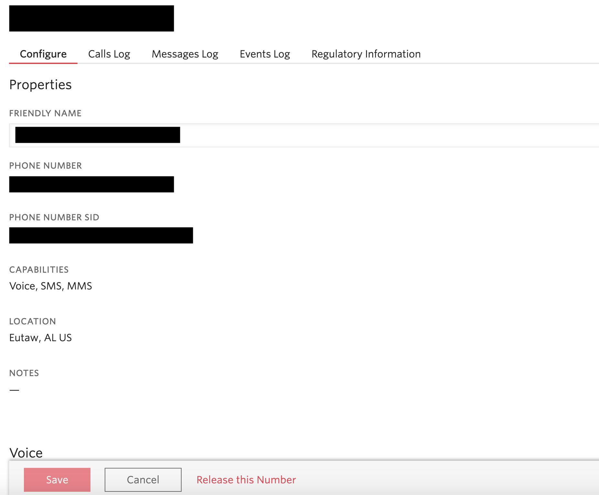
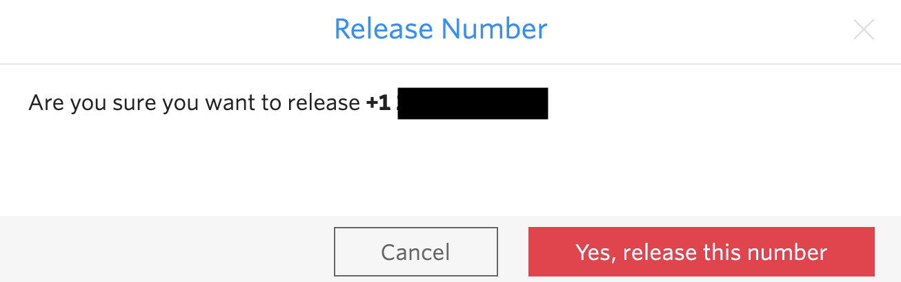
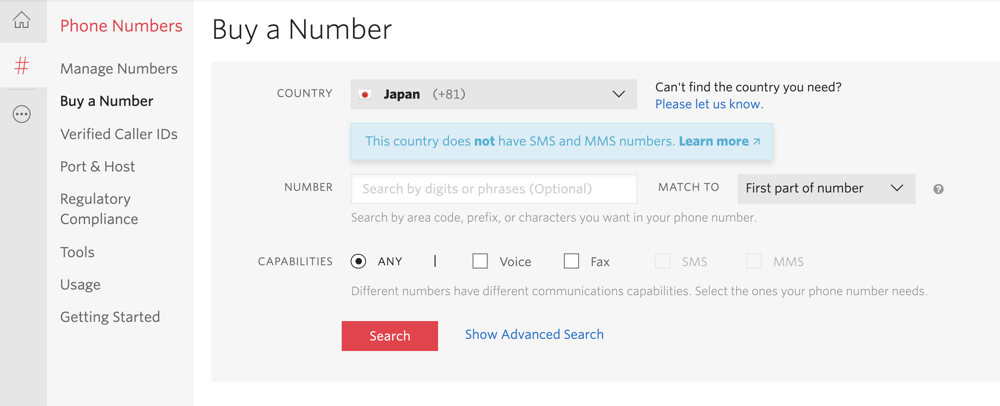
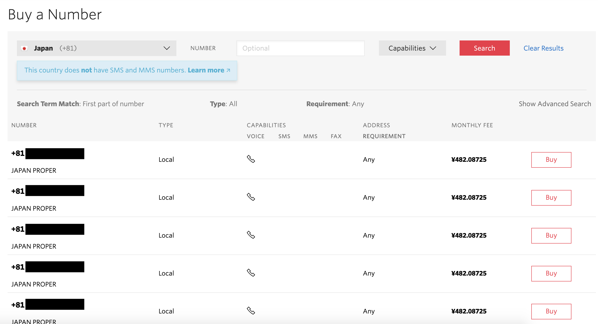
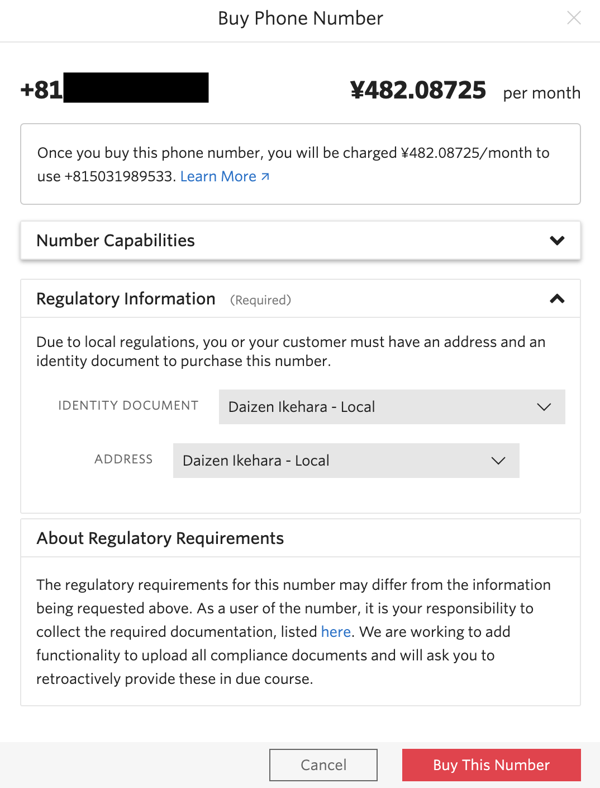
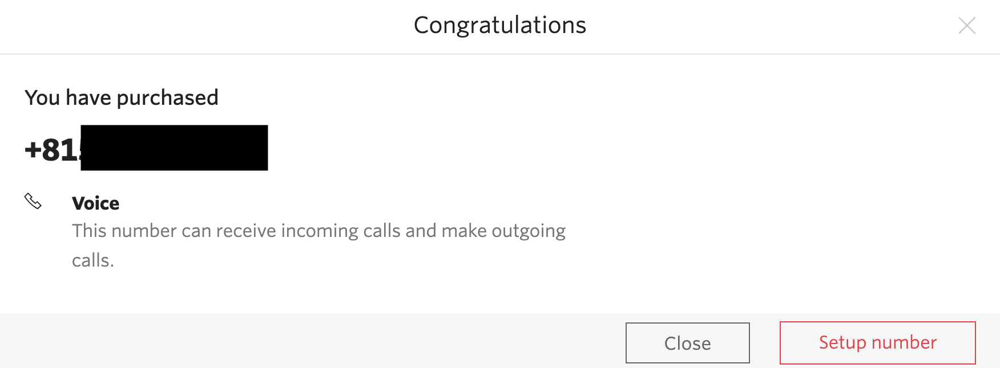

#  手順1: 既存の電話番号をリリースし、新たに日本番号を取得
## はじめに
この手順では、SMSのラボで使用した電話番号をリリースし、新たに日本番号を取得する方法を学習します。
__（注）2019年11月20日より、コンソールから日本の電話番号を取得する場合は本人情報（IdentityId）、住所情報（AddressSid）を本人確認書類と共に登録する必要があります。登録方法については下記をご覧ください。__

[本人情報（IdentitySid）、住所情報（AddressSid）の登録方法](../00-Misc/00-00-IdentitySid.md)

本人情報が登録されており、トライアルアカウントをアップデートされている場合は __1-4__ から進めてください。

## 1-1. コンソールにアクセス
[Twilioホームページ](https://www.twilio.com/)をブラウザーで開き、[LOG IN](https://www.twilio.com/login) をクリックするか、[コンソール](https://www.twilio.com/console)に直接移動します。

## 1-2. Phone Numbersダッシュボードにアクセス
コンソールのサイドバーから __All Products & Services__ をクリックすると、サイドバーが展開されます。そこで __Phone Numbers__ をクリックします。

## 1-3. 購入した電話番号の詳細情報を表示し、電話番号をリリース
購入した番号の一覧から先ほど購入した番号をクリックすると、詳細画面に遷移します。

画面下部に表示されている __Release this Number__ をクリックすると、番号がリリースされ、今後使用することができなくなります。
トライアル版では1番号のみ利用できるため、番号をリリースします。

## 1-4. 日本の番号を新しく取得
__（注）2019年11月20日より、コンソールから日本の電話番号を取得する場合は本人情報（IdentityId）、住所情報（AddressSid）を本人確認書類と共に登録する必要があります。登録方法については下記をご覧ください。__

[本人情報（IdentitySid）、住所情報（AddressSid）の登録方法](../00-Misc/00-00-IdentitySid.md)

続けて、__Buy a Number__ をクリックし、新しい番号の購入画面へと遷移します。電話番号を購入する国を指定し、__Search__ ボタンをクリックします。

一覧から任意の番号を選択し、__Buy__ ボタンをクリックします。

最終確認のダイアログが表示されます。__Buy This Number__ をクリックし、番号を購入します。

購入後、ダイアログが表示されます。 __Setup number__ ボタンをクリックし、設定画面を表示して下さい。

## 関連リソース

- [法令情報（英語）](https://www.twilio.com/guidelines/jp/regulatory)

## 次の手順
[手順2: 入電への応答を設定](./03-02-ReveiveCall.md)