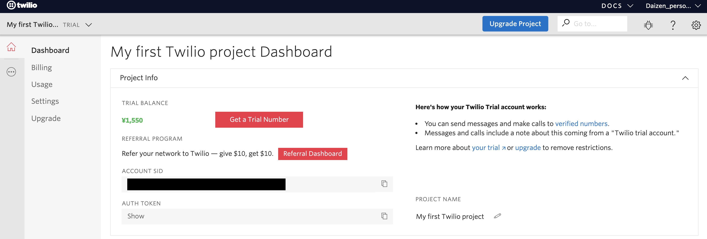

#  手順2: 入電への応答を設定
## はじめに
この手順では、先ほど取得した電話番号への入電に対応する応答を設定する方法を学習します。

## 1-1. 電話番号の設定画面にアクセス
先ほどの手順の最後に開いた電話番号の設定画面から引き続き作業を行います。もし、画面を閉じてしまった場合は、[Twilioホームページ](https://www.twilio.com/)をブラウザーで開き、[LOG IN](https://www.twilio.com/login) をクリックするか、[コンソール](https://www.twilio.com/console)に直接移動し、該当する電話番号の設定画面を表示してください。



## 1-2. 設定画面でVoiceセクションを確認
電話番号の設定画面をスクロールし、Voiceセクションを表示させます。


A CALL COMES INの項目では、この電話番号に入電があった際にどのような応答を返すかを設定できます。標準では既定の音声（英語）が流れるようになっています。一度その番号に電話をかけて確認してみましょう。

## 1-3. TwiML Binを使い静的な応答音声を設定
Programmable Voiceでは __TwiML__ と呼ばれるマークアップ言語を用いて応答音声を設定します。このTwiMLは任意の場所から呼び出すことができます。
今回のハンズオンでは、__TwiML Bin__ を用いて応答音声を設定します。

A CALL COMES INのドロップダウンから、TwiML Binを選択します。


+ボタンを押し、新しいTwiMLを作成します。


わかりやすい名前をFRIENDLY NAMEに設定し、BODYに次の内容を追加します。

```xml 
<?xml version="1.0" encoding="UTF-8"?>
<Response>
    <Say language="ja-JP">応答テスト</Say>
</Response>
```
応答の内容は任意の内容を設定いただいて構いません。正しいフォーマットでない場合は、画面下部に警告が表示されます。下記のスクリーンショットを参考にしてください。


作成が完了した段階で __Create__ ボタンをクリックし、保存します。

最後に、コンソールの __Save__ ボタンをクリックし、電話番号の設定を更新することを忘れないでください。

## 1-4. Voiceの応答テスト
再度、取得した番号に電話をかけ、応答音声が変更されていることを確認してください。

## 1-5. （追加課題1）TwiMLをカスタマイズ
Voiceでは、応答音声を設定する以外にも録音や、カンファレンスコール、音声の再生などを行うことができます、[TwiMLリファレンス](https://jp.twilio.com/docs/voice/twiml)を参考に先ほど作成したTwiMLを変更してみてください。
一度作成したTwiMLは[TwiML Bins](https://www.twilio.com/console/twiml-bins)からアクセスすることができます。


## 関連リソース

- [TwiMLリファレンス](https://jp.twilio.com/docs/voice/twiml)
- [着信通話に応答する](https://jp.twilio.com/docs/voice/tutorials/how-to-respond-to-incoming-phone-calls)
- [通話を発信する](https://jp.twilio.com/docs/voice/tutorials/how-to-make-outbound-phone-calls)